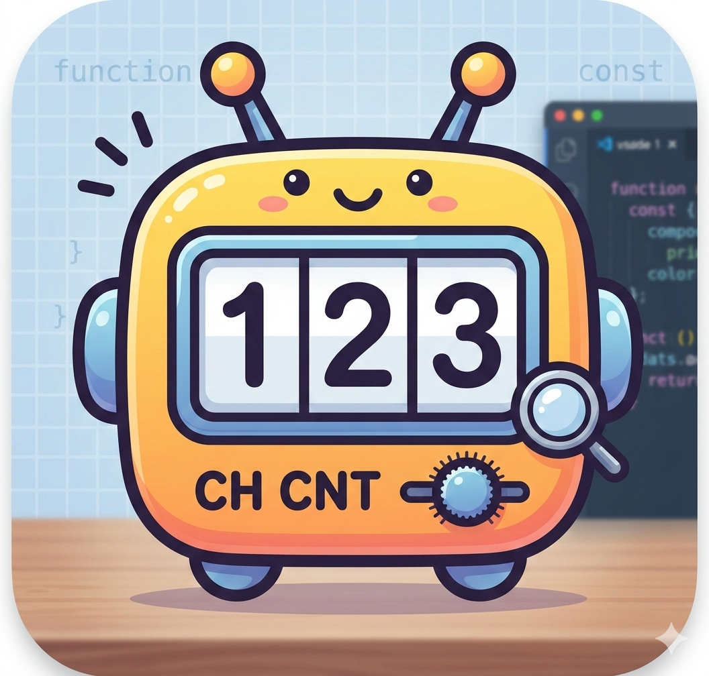
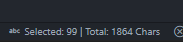

# character-counter

This is a simple extension for Visual Studio Code and Cursor that displays the character count of your document in the status bar.

## Features

*   **Total Character Count**: See the total number of characters in the current file, right in your status bar.
*   **Selection Count**: When you select text, the status bar will update to show the number of selected characters alongside the total count.
*   **Real-time Updates**: The count updates automatically as you type, edit, or change your selection.

## Release Notes

### 0.0.7

Initial release of the Character Counter extension.
