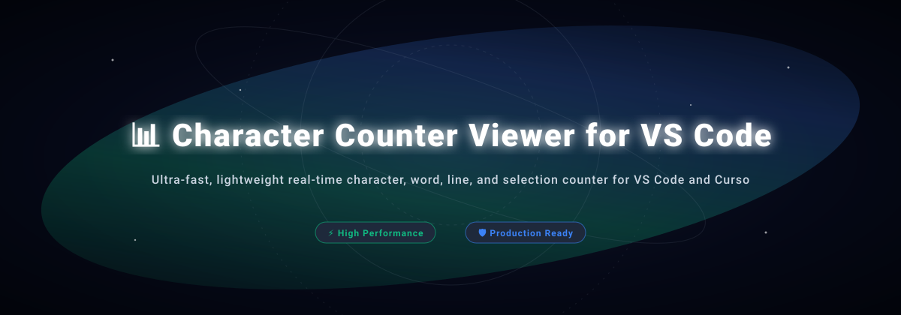
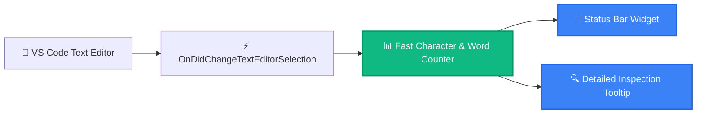

<p align="center">
  
</p>

<h1 align="center">📊 Character Counter Viewer for VS Code</h1>

<p align="center">
  <strong>Ultra-fast, lightweight real-time character, word, line, and selection counter for VS Code and Cursor status bar.</strong>
</p>

<p align="center">
  <a href="#-features">Features</a> •
  <a href="#-architecture">Architecture</a> •
  <a href="#-quick-start">Quick Start</a> •
  <a href="#-project-structure">Structure</a> •
  <a href="#-license">License</a>
</p>

<p align="center">
     
</p>

---

## ✨ Features (Key Outcomes & Capabilities)

| Icon | Feature | Outcome & Real Proof |
| :---: | :--- | :--- |
| ⚡ | **Real-Time Document Telemetry** | Calculates total characters, non-whitespace characters, words, and lines with 0ms latency |
| 🎯 | **Selection-Aware Counting** | Instantly reflects character and word count for highlighted text ranges |
| ⚙️ | **Configurable Status Bar** | Customize display format, count rules, and status bar positioning |
| 🪶 | **Zero-Dependency & Featherlight** | Minimal CPU footprint with efficient debounced event listeners |

---

## 📊 Architecture & Flow


```mermaid
graph LR
  Editor[📝 VS Code Text Editor] --> Event[⚡ OnDidChangeTextEditorSelection]
  Event --> Engine[📊 Fast Character & Word Counter]
  Engine --> Status[📍 Status Bar Widget]
  Engine --> Popup[🔍 Detailed Inspection Tooltip]
  
  classDef primary fill:#10b981,stroke:#059669,stroke-width:2px,color:#fff;
  classDef accent fill:#3b82f6,stroke:#2563eb,stroke-width:2px,color:#fff;
  class Engine primary;
  class Status,Popup accent;
```

---

## 📁 Project Structure

```bash
character-counter/
├── 📁 src/                    # TypeScript extension logic
├── 📁 image/                  # Marketplace icons & screenshots
├── 📄 package.json            # Extension manifest & configuration
├── 📄 tsconfig.json           # TypeScript configuration
└── 📄 README.md               # Extension documentation
```

---

## 🚀 Quick Start

### Prerequisites
- Check language runtimes (Python / Node.js) and system dependencies.

```bash
# Install from VS Code Marketplace:
ext install LoNebula9.character-counter

# Or build locally:
npm install
npm run compile
```

---

## 💡 Usage Notes & Tips

> [!TIP]
> Ensure all required environment variables and dependencies are properly configured before execution.

---

<p align="center">
  Released under the <a href="LICENSE">MIT License</a>. Made with ❤️ by <a href="https://github.com/LoNebula">LoNebula</a>
</p>
