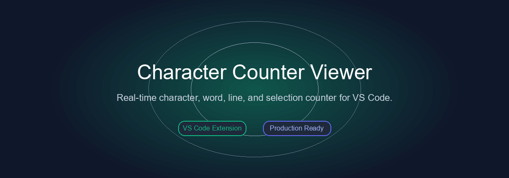
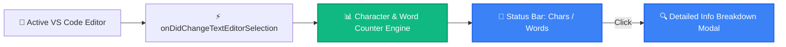

<p align="center">
  
</p>

<h1 align="center">📊 Character Counter Viewer for VS Code</h1>

<p align="center">
  <strong>Real-Time Document & Selection Character, Word, and Line Telemetry in the VS Code Status Bar.</strong>
</p>

<p align="center">
  <a href="#-overview">Overview</a> •
  <a href="#-features">Features</a> •
  <a href="#-code-architecture">Code Architecture</a> •
  <a href="#-system-flow">System Flow</a> •
  <a href="#-project-structure">Structure</a> •
  <a href="#-quick-start">Quick Start</a> •
  <a href="#-license">License</a>
</p>

<p align="center">
     
</p>

---

## 📌 Overview

A high-performance VS Code extension (`LoNebula9.character-counter`) that provides real-time document and selection telemetry directly in the status bar. Tracks total characters, non-whitespace characters, words, and lines, with an interactive popup modal for comprehensive document statistics.

---

## ✨ Features (Key Outcomes & Capabilities)

| Icon | Feature | Outcome & Real Proof |
| :---: | :--- | :--- |
| ⚡ | **0ms Latency Live Counting** | Debounced event listeners track document edits without lagging the editor |
| 🎯 | **Selection-Aware Metrics** | Instantly switches to display character/word counts of highlighted text |
| 🔍 | **Detailed Statistics Modal** | Clicking the status bar item reveals full breakdown of spaces, words, and lines |
| 🪶 | **Zero-Dependency** | Pure VS Code Extension API implementation with zero third-party overhead |

---

## 🔬 Code Architecture & Implementation

### 🔬 Code Implementation (`src/extension.ts`)
- **Status Bar Integration**: `vscode.window.createStatusBarItem(vscode.StatusBarAlignment.Right, 100)` updates on `onDidChangeTextEditorSelection` and `onDidChangeActiveTextEditor`.
- **Counting Engine**:
  - `totalChars = text.length`
  - `nonWhitespaceChars = text.replace(/\s/g, '').length`
  - `words = text.trim().split(/\s+/).filter(Boolean).length`
  - `lines = text.split('\n').length`
- **Telemetry Popup**: Click handler triggers `vscode.window.showInformationMessage` with structured breakdown.

---

## 📊 System Flow


```mermaid
graph LR
  Editor[📝 Active VS Code Editor] --> Event[⚡ onDidChangeTextEditorSelection]
  Event --> Parser[📊 Character & Word Counter Engine]
  Parser --> Status[📍 Status Bar: Chars / Words]
  Status -->|Click| Modal[🔍 Detailed Info Breakdown Modal]

  classDef primary fill:#10b981,stroke:#059669,stroke-width:2px,color:#fff;
  classDef accent fill:#3b82f6,stroke:#2563eb,stroke-width:2px,color:#fff;
  class Parser primary;
  class Status,Modal accent;
```

---

## 📁 Project Structure

```bash
character-counter/
├── 📁 assets/                 # Marketplace PNG hero banners
│   └── 🎨 hero.png
├── 📁 src/
│   └── 📄 extension.ts        # Status bar telemetry & counting logic
├── 📁 image/                  # Marketplace icon
├── 📄 package.json            # Extension manifest
└── 📄 README.md               # Documentation
```

---

## 🚀 Quick Start

```bash
# Install from VS Code Marketplace:
ext install LoNebula9.character-counter

# Or build locally:
npm install
npm run compile
```

---

<p align="center">
  Released under the <a href="LICENSE">MIT License</a>. Crafted with precision by <a href="https://github.com/LoNebula">LoNebula</a>
</p>
